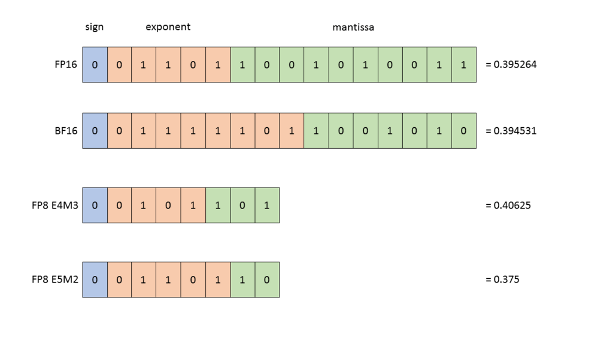

# Tensor precision / Data types

These are the common datatypes that are used as of this writing in ML (usually referred to as `dtype`):

Floating point formats:
- fp32 - 32 bits
- tf32 - 19 bits (NVIDIA Ampere+)
- fp16 - 16 bits
- bf16 - 16 bits
- fp8 - 8 bits (E4M3 and E5M2 formats)

For visual comparison refer to this representations:


([source](https://developer.nvidia.com/blog/accelerating-ai-training-with-tf32-tensor-cores/))



([source](https://docs.nvidia.com/deeplearning/transformer-engine/user-guide/examples/fp8_primer.html))

Integer formats used in quantization:

- int8 - 8 bits
- int4 - 4 bits
- int1 - 1 bits

## ML dtype progression

Originally ML was using fp32, but it was very slow.

Next [mixed-precision was invented using a combination of fp16 and fp32](https://developer.nvidia.com/blog/video-mixed-precision-techniques-tensor-cores-deep-learning/) was invented which tremendously sped up the training speed.


([source](https://developer.nvidia.com/blog/video-mixed-precision-techniques-tensor-cores-deep-learning/))

But fp16 proved to be not very stable and training LLM was extremely difficult.

Luckily bf16 came out and replaced fp16 using the same mixed precision protocol. This made the LLM training much more stable.

Then fp8 came and mixed precision has switched to [that](https://docs.nvidia.com/deeplearning/transformer-engine/user-guide/examples/fp8_primer.html) and which makes the training even faster. See the paper: [FP8 Formats for Deep Learning](https://arxiv.org/abs/2209.05433).

To appreciate the speed ups between the different formats have a look at this table for NVIDIA A100 TFLOPS spec (w/o sparsity):

| Data type              | TFLOPS |
| :---                   |    --: |
| FP32                   |   19.5 |
| Tensor Float 32 (TF32) |    156 |
| BFLOAT16 Tensor Core   |    312 |
| FP16 Tensor Core       |    312 |
| FP8 Tensor Core        |    624 |
| INT8 Tensor Core       |    624 |

Each next dtype is about 2x faster than the previous one (except fp32 which is much slower than the rest).

In parallel with the mixed training regime the ML community starting coming up with various quantization approaches. Probably one of the best examples is Tim Dettmers' [bitsandbytes](https://github.com/TimDettmers/bitsandbytes) which provides many 4 and 8-bit quantization solutions. The Deepspeed team also has some [interesting quantization solutions](https://www.deepspeed.ai/tutorials/model-compression/).

## TF32

TF32 is a magical datatype that is available on NVIDIA GPUs since Ampere, and which allows fp32 `matmul`s performed at a much faster speed than normal fp32 `matmul`s with a small precision loss.

Here is an example of A100 TFLOPS (w/o sparsity):

| Data type              | TFLOPS |
| :---                   |    --: |
| FP32                   |   19.5 |
| Tensor Float 32 (TF32) |    156 |

As you can see TF32 is 8x faster than FP32!

It's disabled by default. To enable it add at the beginning of your program:

```
torch.backends.cuda.matmul.allow_tf32 = True
torch.backends.cudnn.allow_tf32 = True
```

For more information about the actual precision loss please see [this](https://pytorch.org/docs/stable/notes/cuda.html#tensorfloat-32-tf32-on-ampere-and-later-devices).


## When to use fp32 accumulators

Whenever a low-precision dtype is used one has to be careful not to accumulate intermediary results in that dtype.

`LayerNorm`-like operations must not do their work in half-precision, or they may lose a lot of data. Therefore when  these operations are implemented correctly they do efficient internal work in the dtype of the inputs, but using the fp32 accumulation registers and then their outputs are downcast to the precision of the inputs.

Generally it's just the accumulation that is done in fp32, since adding up many low-precision numbers is very lossy otherwise.

Here are some examples:

1. Reduction collectives

* fp16: ok to do in fp16 if loss scaling is in place

* bf16: only ok in fp32

2. Gradient accumulation

* best done in fp32 for fp16 and bf16, but definitely is a must for bf16

3. Optimizer step / Vanishing gradients

* when adding a tiny gradient to a large number, that addition is often nullified therefore typically fp32 master weights and fp32 optim states are used.

* f16 master weights and optim states can be used when using [Kahan Summation](https://en.wikipedia.org/wiki/Kahan_summation_algorithm)
or [Stochastic rounding](https://en.wikipedia.org/wiki/Rounding) (introduced in [Revisiting BFloat16 Training](https://arxiv.org/abs/2010.06192)).

For an example of the latter see: [AnyPrecision optimizer](https://github.com/pytorch/torchdistx/pull/52) with the latest version found [here](https://github.com/facebookresearch/multimodal/blob/6bf3779a064dc72cde48793521a5be151695fc62/torchmultimodal/modules/optimizers/anyprecision.py#L17).


## Changing precision post training

Sometimes it's OK to change precision after the model was trained.

- Using bf16-pretrained model in fp16 regime usually fails - due to overflows (the biggest number that can be represented in fp16 is 64k) for an indepth discussion and possible workaround see this [PR](https://github.com/huggingface/transformers/pull/10956).

- Using fp16-pretrained model in bf16 regime usually works - it will lose some performance on conversion, but should work - best to finetune a bit before using it.
